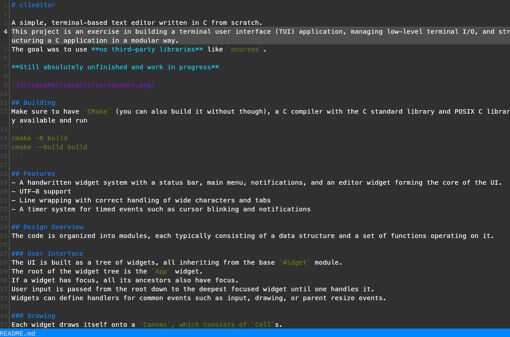

# clieditor

A simple, terminal-based text editor written in C from scratch.  
This project is an exercise in building a terminal user interface (TUI) application, managing low-level terminal I/O, and structuring a C application in a modular way.  
The goal was to use **no third-party libraries** like `ncurses`.

**Still absolutely unfinished and work in progress**



## Building
Make sure to have `CMake` (you can also build it without though), a C compiler with the C standard library and POSIX C library available and run
```
cmake -B build
cmake --build build
```

## Features
- A handwritten widget system with a status bar, main menu, notifications, and an editor widget forming the core of the UI.
- UTF-8 support
- Line wrapping with correct handling of wide characters and tabs
- A timer system for timed events such as cursor blinking and notifications

## Design Overview
The code is organized into modules, each typically consisting of a data structure and a set of functions operating on it.

### User Interface
The UI is built as a tree of widgets, all inheriting from the base `Widget` module.  
The root of the widget tree is the `App` widget.  
If a widget has focus, all its ancestors also have focus.  
User input is passed from the root down to the deepest focused widget until one handles it.  
Widgets can define handlers for common events such as input, drawing, or parent resize events.

### Drawing
Each widget draws itself onto a `Canvas`, which consists of `Cell`s.  
Canvases are layered and clipped together, and finally compared to the special `Screen` canvas.  
Only changed `Cell`s are written to the `Terminal`, the module that directly interacts with the terminal device.

### Editor
The editor itself is composed of several tightly integrated modules:
- **`TextBuffer`** — holds the complete text as a doubly-linked list of `Line`s, with a gap buffer for efficient editing.  
- **`TextLayout`** — calculates which lines are visible on screen, where wrapping occurs, how tabs expand and where the cursor visually is on screen. It's also responsible also for scrolling.
- **`TextEdit`** — handles text modifications like inserting or deleting characters in the buffer and moving the cursor.  
The `Editor` widget brings these parts together and manages user interaction and rendering.

## Directory Structure

### `common/`
Fundamental, reusable modules with no dependencies on the rest of the editor, e.g., UTF-8 utilities and logging.

### `io/`
Handles all direct interaction with the system — terminal I/O, file reading, etc.  
This is the only layer with platform-specific code.

### `display/`
Abstract rendering layer — defines *what* to draw (via `Canvas`, `Cell`, and `Widget`), but not *how* it’s shown on screen.

### `document/`
The core data model of the editor. Manages text independently of the UI.

### `widgets/`
All concrete UI components, like the editor view, status bar, or labels.  
The `App` widget forms the root of the widget hierarchy.

### `main.c`
Entry point of the application. Initializes all systems, loads the file, and runs the main loop.

## Questionable Design Choices

### UTF8 Support
I had no idea how UTF-8 actually worked in C, so I quickly threw together an `UTF8Char` struct and `UTF8String` containers built from it.
To be fair, they turned out to be quite robust and easy to use — which is the good part.
The bad part is that I now use at least 5 bytes per character, which blows up memory usage pretty fast.
For example, the release build needs around *600 MB* to load a *100 MB* file, which seems… a bit much.

## License 

This project is licensed under the GNU General Public License v3.0 (GPL-3.0).

You may obtain a copy of the license at:

https://www.gnu.org/licenses/gpl-3.0.html
